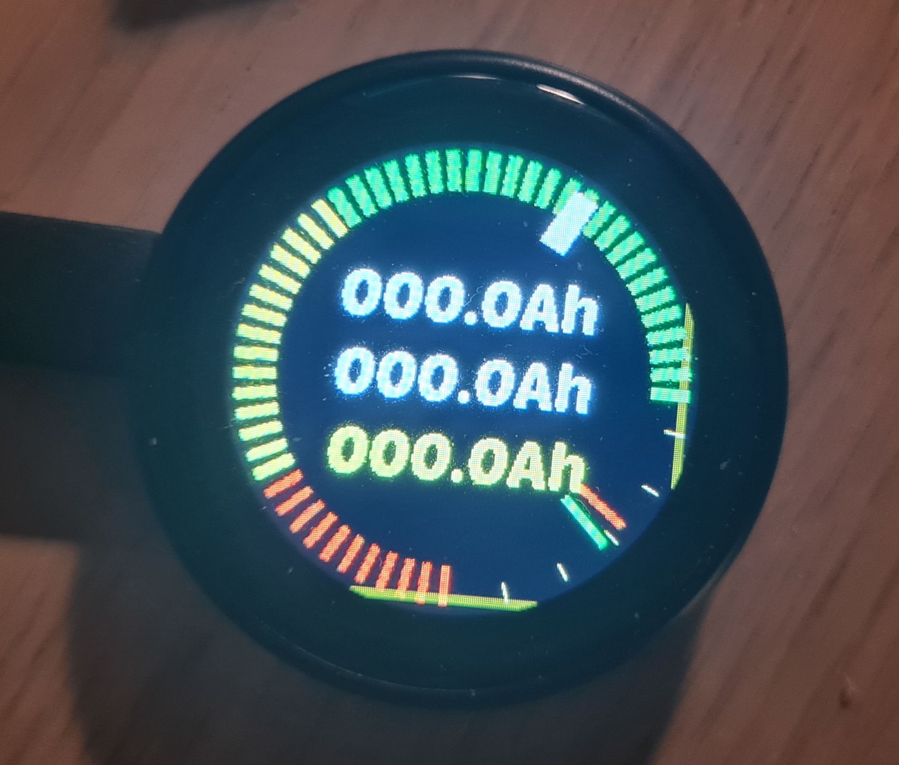

# Energy Monitor

A sample energy/battery monitoring screen which uses ESPHome and LVGL to create a nice display unit and fetches data from the SignalK server using the external SignalK component.
The project is loaded to a ESP32-C3 1.28 Inch Round Display GC9A01 IPS LCD Touch Screen whcih i recently purchased from AliExpress. 
If your hardware is different you probably need to tweak microcontroller and display settings to suit your hardware.

## Features

1. State fo chart, The value is fetched from victron shunt
1. Shore power current in Ah
1. LFP Battery current in Ah
1. Solar production current in Ah
1. LFP battery voltage
1. Starter batter voltage